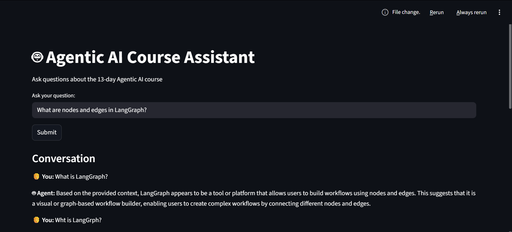
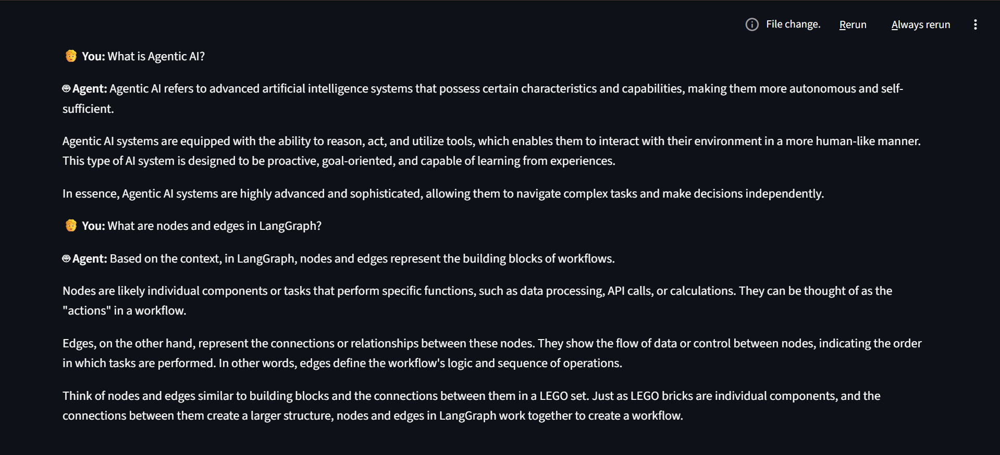

# 🤖 Agentic AI Course Assistant

## 📸 Demo

---

## 📌 Overview
This project is an AI-powered assistant built using concepts from the 13-day Agentic AI course.  
It answers questions related to topics such as LangChain, LangGraph, RAG, embeddings, and AI agents.

The system uses Retrieval-Augmented Generation (RAG) to provide accurate answers based on stored knowledge.

---

## 🚀 Features
- 💬 Interactive chat interface using Streamlit  
- 🧠 Context-based answers using RAG  
- 🔍 Semantic search using ChromaDB  
- ⚡ Fast responses using Groq LLM  
- 📚 Covers full course topics  

---

## 🏗️ Tech Stack
- Python  
- LangChain  
- LangGraph  
- ChromaDB  
- Sentence Transformers  
- Groq API  
- Streamlit  

---

## 📂 Project Structure
agent.py → Core logic (RAG + LLM)
capstone_streamlit.py → UI using Streamlit
day_13_capstone.ipynb → Development notebook
README.md → Documentation

---

## ▶️ How to Run

### 1. Install dependencies
pip install langchain langgraph langchain-groq langchain-community chromadb sentence-transformers streamlit

### 2. Set API Key
setx GROQ_API_KEY "your_api_key_here"

### 3. Run the app

streamlit run capstone_streamlit.py

---

## 🧪 Example Questions
- What is LangGraph?  
- What is RAG?  
- What is LangChain?  
- What is ChromaDB?  
- How does memory work in AI agents?  

---

## 📊 Output
The assistant retrieves relevant context using vector search and generates accurate answers using LLM.

---

## 👨‍💻 Author
Ashish Kumar

